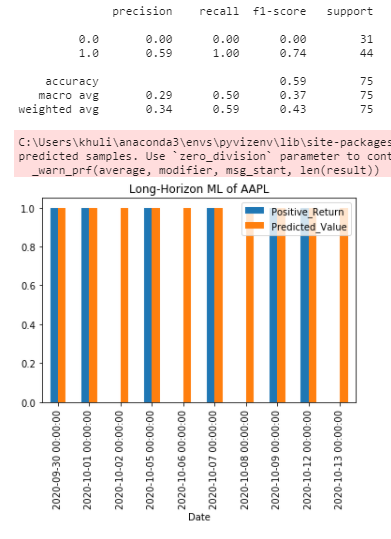
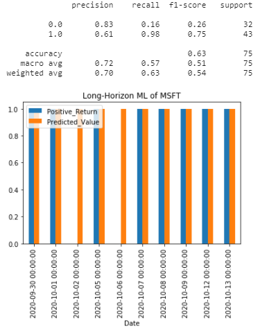
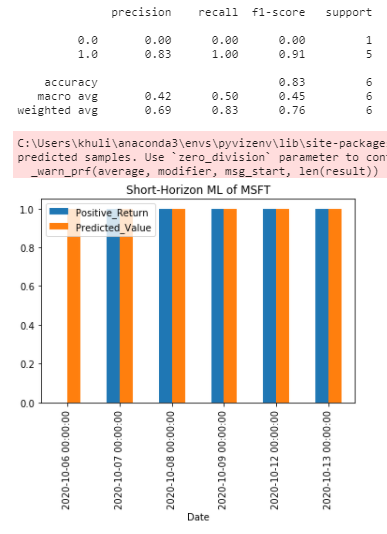
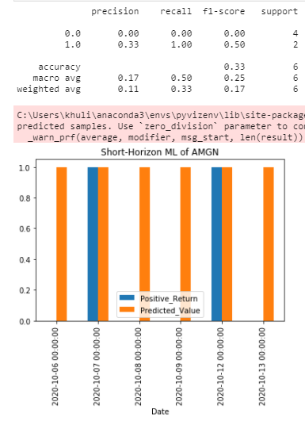

# DJ 30 Trading BOT

(Picture from ActiveState.com)

### Contributors: 
Phara Dorisca (https://github.com/pdorisca), Khulika Rojanakanoksak (https://github.com/Khulikaroj), Femi Aina (https://github.com/Femi-tech) ,Ogo Nwanyanwu (https://github.com/Ogo1024)

In this project, we try to build a trading Bot which rely trading decicion on a Machine Learning of 3 main components that we beleive that are important on determining trading strategy and timing. These components are Fundamental, Technical, and Sentiment In each component, we biuld buy/sell signals based on the represent indicators. Benefit from haveing Bot trading DJ 30 is to rely decision on these signals we have from the core components and reduce emotion from determining strategy and timing to get in and out of DJ 30. 

DJ 30 are AXP, AMGN, AAPL, BA, CAT, CSCO, CVX, GS, HD, HON, IBM, INTC, JNJ, KO, JPM, MCD, MMM, MRK, MSFT, NKE, PG, TRV, UNH, CRM, VZ, V, WBA, WMT, DIS, DOW

Machine Learning method: Random Forest. 

## Jupyter Notebooks

1. ML.ipynb: Main notebook for traning and testing Machine Learning.

2. Sentiment.ipynb: Building sentiment signals from News API by using NLP (Vader sentiment analyzer).

3. Trade.ipynb: Code for feeding into AWS EC2 which is connected to Alpaca trading platform. **Disclaimer: We haven't modify this code to take prediction from ML in order to determine timing to buy DJ30. 

## CSV files

1. fundamental_signal
2. technical_signal
3. sentiment_signal
4. company_list_DJ30

## Features for ML

We build signal data  from 3 main components which are..
1. Fundamental: ROE, Operation margin, Debt-to-Equity ratio, and Pietroskie F-score
2. Technical: RSI
3. Sentiment: News relevant to company name
Sources of these data are XXX, Yahoo Finance, and News API.
However, we can pull News API by just 1 month back bacause of limitation of trial account. With this limitation, we plan to split the data  into long-horizon and short-horizon data sets. 

Long-Horizon Model: In thr longer-horizon data, the features used in ML model are just Fundamental and Technical. We set horizon for 1 year in this model.

Short-Horizon Model: For short-horizon, all 3 main features will be included in the ML model. We set horizon for 30 days in this model.

## Functions

1. build_input_long( ): building dataframe for using in longer-horizon ML.

2. build_input_short( ): building dataframe for using in longer-horizon ML.

3. X_train_long( ), X_test_long( ): split training and teseting features for x_var_list_long = ["ROE_Sig", "OpMargin_Sig","DebtEq_Sig","Fscore_Sig","RSI"], Long-Horizon ML.

4. y_train_long( ), y_train_long( ): split y for using in Longer-Horizon ML.

5. X_train_short( ), X_test_short( ): split training and teseting features for x_var_list_long = ["ROE_Sig", "OpMargin_Sig","DebtEq_Sig","Fscore_Sig","RSI","Sentiment"], Short-Horizon ML.

6. y_train_short( ), y_train_short( ): split y for using in Short-Horizon ML.

7. random_forest( ): training, fitting, predicting positive trade signal by Random Forest Model. The function will return prediction dataframe and classification report.

## Conclusions

* In using Fundamental and Technical signals to predict days with positive return of particular stock, the ML perform well for most of stocks in DJ30. The model is unlikely fit for predicting timing to buy AMGN and JNJ.

* Adding Sentiment signals increase prediction power for most stocks in DJ30 list. However, this better prediction power could arrive from using more recent features than Long-Horizon model. However, contrast evidence is seen in JPM stock.

* Using ML to predict timing to enter/exit stock trading strategy should be done with caution. Further wotks needed for improving this project could be (1) using RNN model which fit better for time-series data, or (2) expanding sentiment signal data by web scrapping news or paid-account for News API. 

## Example of prediction and model evaluation

ML result on AAPL

ML result on MSFT

ML result on AMGN

ML result on JNJ

